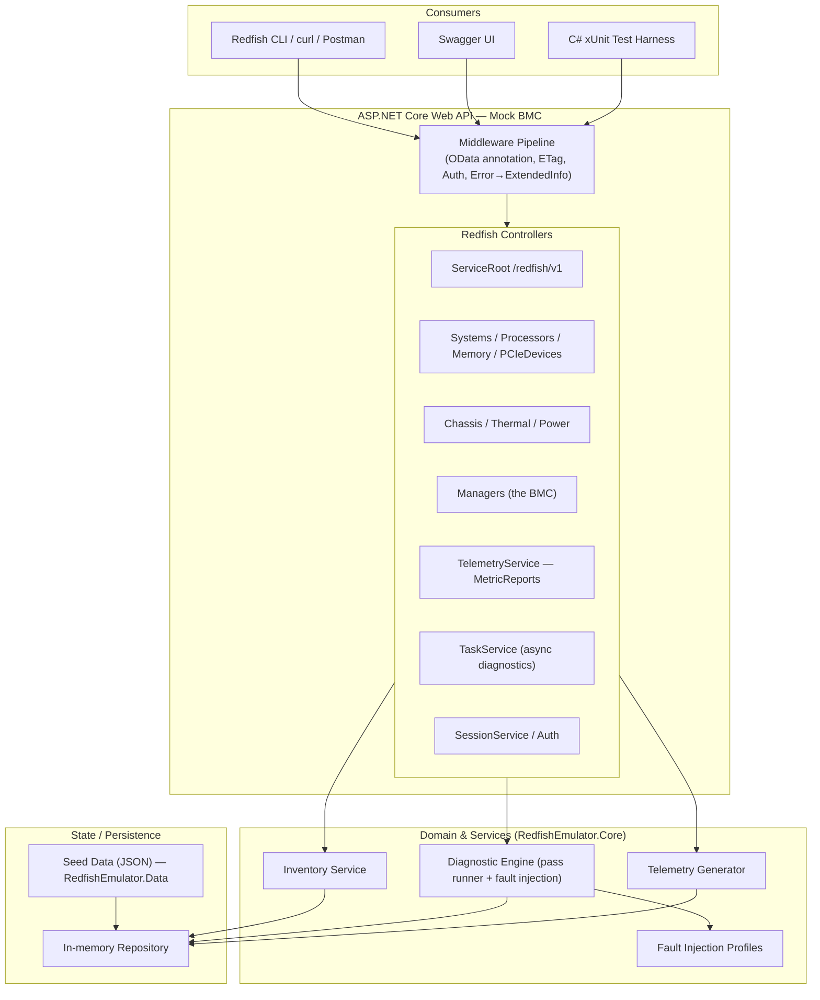
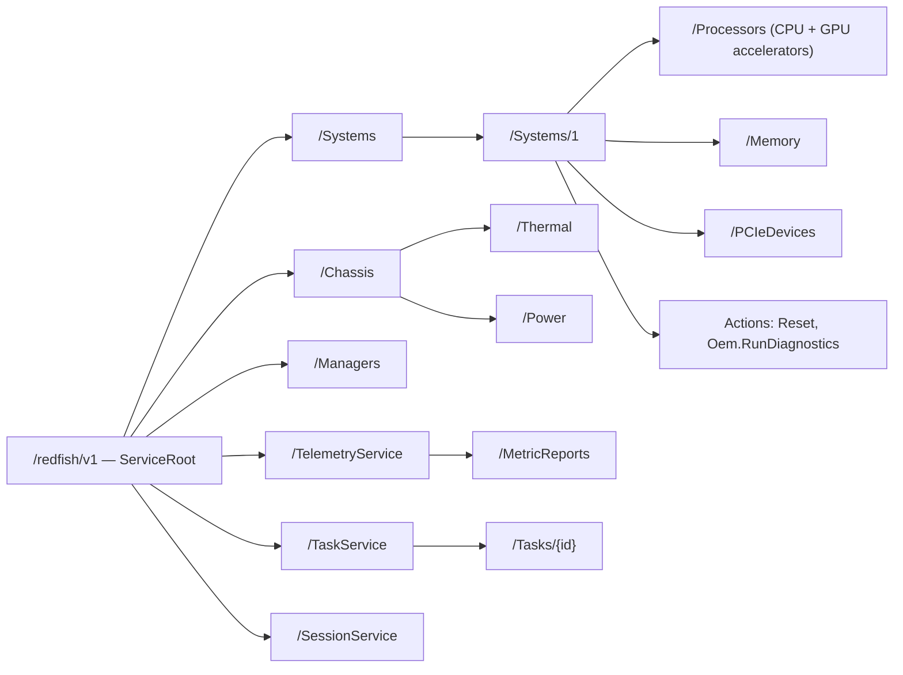

# Architecture

## System layers

## Redfish resource tree

## Design principles

- **`Core` has no ASP.NET dependency.** Redfish models and the diagnostic engine are pure
  domain logic, testable without a web host.
- **Redfish authenticity.** Every resource carries `@odata.id` / `@odata.type` /
  `@odata.context`; collections use `Members` + `Members@odata.count`; health is reported
  via the standard `Status { State, Health, HealthRollup }` object; errors use the Redfish
  `ExtendedInfo` message-registry shape; long-running diagnostics return `202 Accepted`
  with a `TaskMonitor` URL.
- **Three test projects by intent.** Unit (logic) / Contract (Redfish + OData conformance) /
  Stress (concurrency + fault modes). This split is the "validation framework" story.
- **Fault injection as pluggable profiles.** Each failure mode implements `IFaultProfile`,
  so stress tests can activate e.g. "GPU fell off the bus" and assert the engine reports
  `Health: Critical`.
